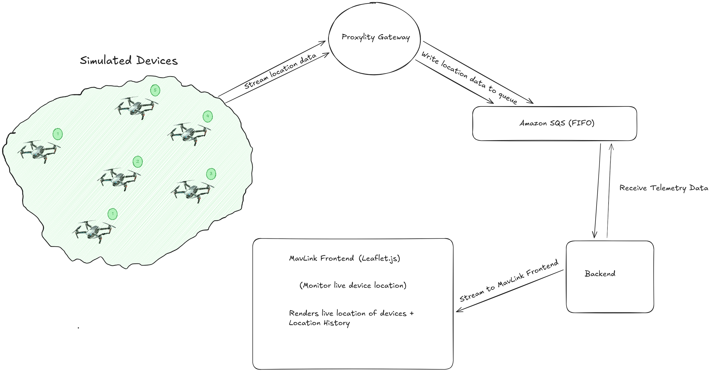

# MavLink Demo (Proxylity)


This project aims to demonstrate the power of proxylity as an efficient UDP Gateway system, using MAVLINK as an example.

MAVLINK is a UDP protocol, used widely by IOT devices to stream telemetry data with metrics like Position, Health, Temperature, e.t.c.

This project demos a simpler example; we simulate drone location data, push to proxylity's gateway which in turn pushes to a `FIFO` queue on AWS.

We read from `FIFO` queue and write to active websocket connections, these websocket connections are initiated on the frontend application which renders
a map for showing device locations. We receive websocket update about a new device and update it's position live on the map.


## Architecture Diagram



## Overview

There are 3 components to making this demo work as expected:

- [Backend](./backend/README.md): Contains logic for polling queue and streaming result to websocket connection
- [Frontend](./frontend/README.md): Renders the map page which displays live locations of registered devices.
- [Simulator](./simulator/README.md): when called, simulates `n` devices and streams their locations as mavlink packets to **proxylity's udp gateway**.

## Deploying

> **NOTE**: The instructions below assume the `aws` CLI, `jq` and `sam` are available on your Linux system.\

To deploy the template:

```bash
sam deploy \
    --stack-name mavlink-stack \
    --template-file ./template.json \
    --capabilities CAPABILITY_IAM \
    --region us-west-2
```

Once deployed, to get the ouputs from the stack and store the salient values in environment variables:

```bash
aws cloudformation describe-stacks \
  --stack-name mavlink-stack \
  --query "Stacks[0].Outputs" \
  --region us-west-2 \
  > outputs.json 

export DOMAIN=$(jq -r ".[]|select(.OutputKey==\"Domain\")|.OutputValue" outputs.json)
export PORT=$(jq -r ".[]|select(.OutputKey==\"Port\")|.OutputValue" outputs.json)
export SQS_URL=$(jq -r ".[]|select(.OutputKey==\"QueueUrl\")|.OutputValue" outputs.json)
```

## Environment Setup

To setup environment variables correctly, we need to follow the instructions for each component
- [Backend Environment Setup](./backend/README.md#environment-variables)
- [Frontend Environment Setup](./frontend/README.md#environment-variables)
- [Simulator Environment Setup](./simulator/README.md#environment-variables)


## Launch

> **NOTE**: The instructions below assume the `docker compose` CLI is available on your Linux system.\

To start `backend` and `frontend` services:

```bash
docker compose up backend frontend
```

This automatically builds a new image before starting a container.

Navigate to the [Frontend](http://localhost:5175). Initially it shows an empty map, centered at `London` as it's starting coordinates.

To stream telemetry data:

```bash
docker compose up simulator
```

You should see new devices registered on the map with realtime location updates every 1s.

## SQS Technical Details

Proxylity forwards packet data to SQS per the documented [SQS Destinations](https://www.proxylity.com/docs/destinations/sqs.html) behavior. In this example we've configured both a standard and a FIFO queue with different delivery options.

### Standard Queue Destination

The first destination uses default delivery behavior:
* **Format**: JSON payload containing packet metadata and data
* **Message Attributes**: None (default)
* **Batching**: Up to 10 messages or 1 second timeout

### FIFO Queue Destination

The second destination demonstrates advanced FIFO queue configuration:
* **Format**: Raw payload delivery using UTF-8 encoding (`SendRaw: true`)
* **Message Attributes**: Enabled (`UseMessageAttributes: true`) to include source IP/port, domain, and ingress port metadata
* **MessageGroupId**: Extracted from the first byte of the payload, formatted as hex (`MessageGroupIdExpression: "[0:1]"`, `MessageGroupIdFormatter: "hex"`)
* **MessageDeduplicationId**: Extracted from the remaining payload bytes, base64 encoded (`MessageDeduplicationIdExpression: "[1:]"`, `MessageDeduplicationIdFormatter: "base64"`)

The `MessageDeduplicationId` parameter is required for FIFO queues when `ContentBasedDeduplication` is not enabled. Using the expression-based approach allows you to extract deduplication IDs directly from your UDP packet payloads, giving you full control over message deduplication logic.

Similarly, `MessageGroupId` determines the ordering and processing scope within FIFO queues. Messages with the same group ID are processed in order, and only one message per group can be in-flight at a time. The expression-based extraction demonstrated here allows you to partition your UDP packet stream into logical groups based on payload content.


## Limitations

* **SQS**: For high throughput, SQS is not the best option. Although, this is a demo example, it is not adviced to use SQS for drone simulation data.
A better alternative would be **Kinesis Data Streams**.
